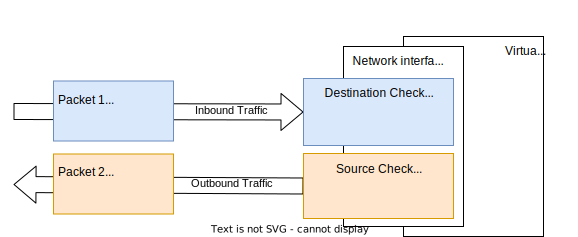

---

copyright:
  years: 2020, 2023
lastupdated: "2023-01-27"

keywords: anti-spoofing, source destination check, ip spoofing

subcollection: vpc

---

{{site.data.keyword.attribute-definition-list}}

# About IP spoofing checks
{: #ip-spoofing-about}

{{site.data.keyword.vpc_full}} includes an IP spoofing check on each network interface of a virtual service instance to ensure that traffic that's coming from that network interface includes appropriate addressing.
{: shortdesc}

Disabling IP spoofing checks allows traffic to pass through the network interface, instead of terminating at the network interface. If you are using the instance as a "next hop", the instance's network interfaces must allow IP spoofing. For example, if you are using a custom load balancer instance, you must set `allow_ip_spoofing` for traffic to reach the instance.

Traffic can be dropped at two points in the check:
- Incoming traffic is checked to make sure it is addressed to the selected network interface. Traffic is dropped if its destination address does not match the selected network interface address.

- Outgoing traffic is checked to verify that the content comes from the selected network interface address. Traffic from the selected network interface is dropped if its source address does not match the selected network interface address.

{: caption="Figure 1. Unsuccessful IP spoofing check" caption-side="bottom"}

{: caption="Figure 2. Successful IP spoofing check" caption-side="bottom"}

Only operators with **IP Spoofing Operator** Identity and Access Management (IAM) privileges can enable or disable the IP spoofing check on the interfaces within a VPC. Ingress and egress IP Spoofing checks are enabled by default.

## Enabling IP spoofing checks
{: #ip-spoofing-enable-check}

After a virtual server instance is created, a network administrator with the **IP Spoofing Operator** role in IAM can update the network interface to enable or disable the IP spoofing check.

The IAM IP Spoofing Operator is disabled by default for all users.
{: note}

For more information about IAM permissions, see [Required permissions](/docs/vpc?topic=vpc-resource-authorizations-required-for-api-and-cli-calls).

To enable IP spoofing in the UI, take the following steps:

1. Go to **Manage > Access (IAM)** in the horizontal navigation bar of your instance.
2. Select **Users** in the **Manage identities** section and choose the user that you want to grant the IP spoofing role.
3. In the **Access policies** tab, click **Assign access**.
4. Select the **Access policy** tile.
5. Select "VPC Infrastructure Services" in the **Service** section.
6. Select "All" in the **Resources** section.
7. Check "IP Spoofing Operator" in the **Roles and actions** section.
8. Click **Add**.

To enable IP spoofing from the CLI, run the following command:

```sh
ibmcloud iam user-policy-create YOUR_USER_EMAIL_ADDRESS --roles "IP Spoofing Operator" --service-name is
```
{: pre}

## Understanding the risks
{: #ip-spoofing-risks}

When you allow IP spoofing on your network interface, consider the potential security risks that are involved. Anyone with the **IP Spoofing Operator** role not only has permission to enable virtual network appliances, but they can configure an instance to send traffic on behalf of another instance, too. This configuration increases the chance of situations where the platform might be attacked due to the action of an uneducated or malicious user.

Be cautious when you assign the **IP Spoofing Operator** role to users.
{: important}

## Alerting for IP spoofing events
{: #ip-spoofing-alerts}

When IP spoofing is modified on a network interface, an Activity Tracker log is generated.

For more information, see the [Getting started tutorial](/docs/activity-tracker?topic=activity-tracker-getting-started) for Activity Tracker.
For more information about setting up alerts, see [Managing alerts through the UI](/docs/activity-tracker?topic=activity-tracker-alerts) and [Managing views and alerts programmatically](/docs/activity-tracker?topic=activity-tracker-config_api).
