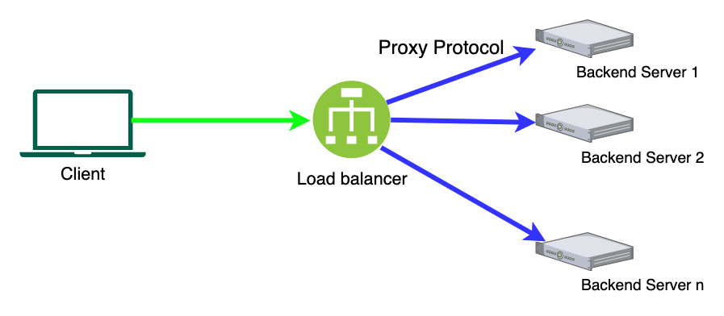

---

copyright:
  years: 2018, 2020
lastupdated: "2020-11-05"

keywords: application load balancer, public, listener, back-end, front-end, pool, round-robin, weighted, connections, methods, policies, APIs, access, ports, layer-7
subcollection: vpc

---

{:shortdesc: .shortdesc}
{:new_window: target="_blank"}
{:codeblock: .codeblock}
{:pre: .pre}
{:note: .note}
{:screen: .screen}
{:tip: .tip}
{:note: .note}
{:important: .important}
{:download: .download}
{:DomainName: data-hd-keyref="DomainName"}
{:external: target="_blank" .external}

# Advanced traffic management
{: #advanced-traffic-management}

The following advanced traffic management features are available in {{site.data.keyword.cloud}} {{site.data.keyword.alb_full}} (ALB).
{:shortdesc}

## Max connections
{: #max-connections}

Use the `max connections` configuration to limit the maximum number of concurrent connections for a given front-end virtual port. If you do not configure a value, the default of `2000` concurrent connections is used. The maximum possible concurrent connections for a given front-end virtual port or system-wide across all front-end virtual ports is `15000`.

## Session persistence
{: #session-persistence}

An application load balancer supports session persistence based on the source IP of the connection. As an example, if you have `source IP` type session persistence that is enabled for port 80 (HTTP), then subsequent HTTP connection attempts from the same source IP client are persistent on the same back-end server. This feature is available for all supported protocols (HTTP, HTTPS, and TCP).

## HTTP keep alive
{: #http-keep-alive}

An ALB supports `HTTP keep alive` as long as it is enabled on both the client and back-end servers. The application load balancer attempts to reuse the server-side HTTP connections to increase connection efficiency and reduce latency.

## Connection timeouts
{: #connection-timeouts}

The following timeout values are used by an application load balancer. You cannot customize these values at this time.

| Name | Description | Timeout |
| ------------------------------------------ | --------------------------------------------------- | ------------------- |
| Server-side connection attempt    | The maximum time window that the load balancer can use to establish TCP connection with the back-end server. If the connection attempt is unsuccessful, the load balancer tries the next available server, according to the load-balancing method configured. | 5 seconds   |
| Client-side idle connection  | The maximum idle time, after which the load balancer brings down the client-side connection, if the client has failed to close its connection properly.| 50 seconds  |
| Server-side idle connection | The maximum idle time (with back-end protocol configuration of TCP), after which the load balancer closes the server-side connection. With the back-end protocol configuration of HTTP, if the load balancer fails to receive a response to its HTTP request within the idle timeout window, it returns an error message to the end client.                                | 50 seconds |
{: caption="Table 1. Application load balancer timeout values" caption-side="top"}

## Preserving end-client IP address (HTTP/HTTPS only)
{: #preserving-end-client-ip-address}

{{site.data.keyword.alb_full}} (ALB) works as a reverse proxy, which terminates incoming traffic from the client. The load balancer establishes a separate connection to the back-end server instance, using its own IP address. For HTTP connections with the back-end servers (against front-end HTTP or HTTPS connections), the load balancer preserves the original client IP address by including it inside the `X-Forwarded-For` HTTP header. For TCP connections, the original client IP information is not preserved.

## Preserving end-client protocol (HTTP/HTTPS only)
{: #preserving-end-client-protocol}

An application load balancer for VPC preserves the original protocol that is used by the client for front-end HTTP and HTTPS connections by including it inside the `X-Forwarded-Proto` HTTP header. This does not apply to TCP protocol since an application load balancer does not look at Layer-7 traffic when TCP protocol is used.

## Enabling proxy protocol 
{: #proxy-protocol-enablement}

You can enable proxy protocol for TCP, HTTP and HTTPS listeners and back-end pools. Use cases are as follows.

### Use case 1: Client connects to load balancer directly 
{: #client-connects-directly-tcp}

{: caption="Proxy Protocol Pool" caption-side="top"}

If the application load balancer is receiving traffic from a client directly, enabling the proxy protocol for the back-end pool of that listener configures the load balancer to attach the proxy protocol header to the TCP packets being sent to that back-end pool. 

All back-end members of that pool must support proxy protocol for the data path to work. You can choose the version of proxy protocol header (version 1 or version 2) when enabling this setting. This setting is disabled by default if not specified. With this setting, the back-end servers can get the client IP and port information that the load balancer sets in the proxy protocol header.
{: note}

### Use case 2: Client connects to a proxy or proxy chain, which then connects to the load balancer using proxy protocol
{: #client-connects-proxy}

{: caption="Proxy Protocol Listener" caption-side="top"}

If the application load balancer is receiving traffic from a proxy (or a proxy chain) that uses proxy protocol, the listener must have proxy protocol enabled so that it can parse the origin client information contained in the proxy protocol headers. This setting is disabled by default, if not specified. Since the load balancer can detect the version of the proxy protocol header and parse it correctly, you don't have to specify which version of proxy protocol is being used to send traffic to the load balancer. Note that when proxy protocol is enabled for a front-end listener, all traffic coming to that frontend port is expected to be proxy protocol traffic. If any of the connections do not contain the proper proxy protocol headers, they won't be established. To forward this client information to the back-end server pool, you must enable proxy protocol for the pool. Similar to use case 1, you must select version 1 or version 2 depending on what version of proxy protocol the back-end servers are configured to use. You can also choose to not forward this client information to the back-end servers if they are not capable of processing this information, and this information will be dropped at the load balancer itself.
