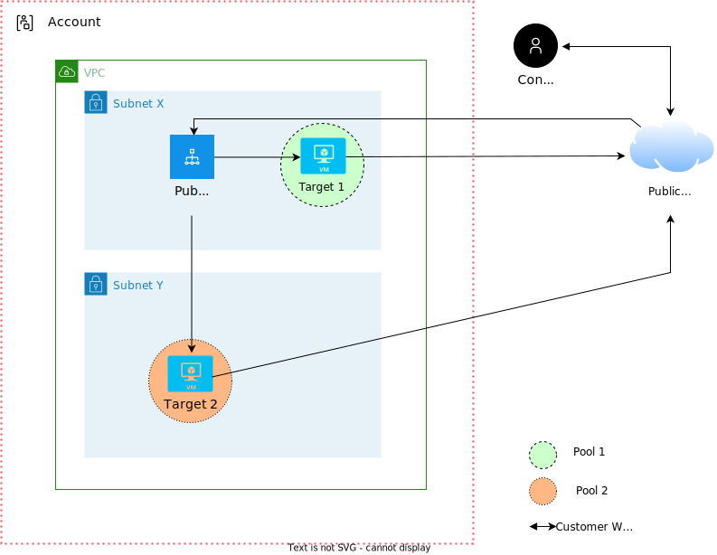

---

copyright:
  years: 2020, 2024
lastupdated: "2024-10-25"

keywords: load balancer, public, listener, back-end, front-end, pool, round-robin, weighted, connections, methods, policies, APIs, access, ports

subcollection: vpc

---

{{site.data.keyword.attribute-definition-list}}

# About network load balancers
{: #network-load-balancers}

You can use the {{site.data.keyword.cloud}} {{site.data.keyword.nlb_full}} (NLB) to distribute traffic among multiple server instances within the same region of your VPC.
{: shortdesc}

NLBs can accept members across all three availability zones, but the NLB itself resides in one specific zone. For more information, see [Multi-zone support](/docs/vpc?topic=vpc-nlb-vs-elb#nlb-mz-support).

It is possible to assign ports per customer, but there is no port enforcement at the VP gateway level.
{: important}

## Types of network load balancers
{: #types-network-load-balancers}

As discussed in the [Load balancers for VPC overview](/docs/vpc?topic=vpc-nlb-vs-elb&interface=ui), many types of NLBs are available:

   * **Public** - A public load balancer is a load balancer with a publicly accessible IP address that is registered with DNS.
   * **Private** - A private load balancer is only accessible from within the VPC network, where the client is in the same VPC or has reachability (for example, through Direct Link, Transit Gateway, or both). For private load balancers, you must have a dedicated subnet with no custom routes configured for the subnet.
   * **Private with routing mode enabled** - Private NLBs with routing mode enabled support only Virtual Network Function (VNF) devices as back-end targets. For more information, see [Creating a network load balancer with routing mode](/docs/vpc?topic=vpc-nlb-vnf&interface=ui).
   * **Private Path** - Service providers use Private Path NLBs to securely connect {{site.data.keyword.cloud_notm}} with third-party, VPC-hosted services on the {{site.data.keyword.cloud_notm}} private network. Private Path NLBs are required when you use [Private Path services](/docs/vpc?topic=vpc-private-path-service-intro) to keep network traffic on a private path that never intersects with the public internet. For more information, see the [Private Path solutions guide](/docs/private-path).

The beta release of IBM Cloud Private Path services is only available to allowlisted users. Contact your IBM Support representative if you are interested in getting early access to this beta offering.
{: beta}

A Private Path service only works with a Private Path NLB.
{: important}

## Getting started
{: #nlb-getting-started}

To get started using network load balancers, follow these steps:

1. Review [Network load balancer limitations](/docs/vpc?topic=vpc-nlb-limitations).
1. Follow instructions for your particular NLB:
   * [Create a public or private network load balancer](/docs/vpc?topic=vpc-nlb-ui-creating-network-load-balancer).
   * [Create a private network load balancer with routing mode](/docs/vpc?topic=vpc-nlb-vnf).
   * [Create a Private Path network load balancer](/docs/vpc?topic=vpc-ppnlb-ui-creating-private-path-network-load-balancer).

For more information, see [Types of load balancers](/docs/vpc?topic=vpc-nlb-vs-elb&interface=ui#load-balancer-types) and the [Load balancer comparison chart](/docs/vpc?topic=vpc-nlb-vs-elb&interface=ui#lb-comparison-chart).
{: note}

## Load-balancing methods
{: #network-load-balancing-methods}

Three load-balancing methods are available for distributing traffic across back-end application servers: round-robin, weighted round-robin, and least connections.

### Round-robin
{: #round-robin-method}

Round-robin is the default load-balancing method. With this method, the load balancer forwards incoming client connections in a round-robin fashion to the back-end servers. As a result, all back-end servers receive roughly an equal number of client connections.

### Weighted round-robin
{: #weighted-round-robin-method}

With this method, the load balancer forwards incoming client connections to the back-end servers in proportion to the weight assigned to these servers. Each server is assigned a default weight of `50`, which can be customized to any value in the range `0 - 100`.

For example, if application servers A, B, and C have the weights `60`, `60`, and `30`, then servers A and B receive an equal number of connections, while server C receives half that number of connections.

The server weight values are applicable only with the weighted round-robin method. They are ignored with the round-robin and least connections load-balancing methods.

Setting a server weight to `0` means that no new connections are forwarded to that server, but any existing traffic continues to flow. Using a weight of `0` can help to gradually bring down a server and remove it from service rotation.
{: tip}

### Least connections
{: #least-connections-method}

With this method, the back-end server instance that serves the least number of connections at a particular time receives the next client connection.

A Private Path NLB does not support the least-connection method.
{: important}

## Front-end listeners and back-end pools
{: #nlb-front-end-listeners-and-back-end-pools}

Front-end listeners are application ports for load balancers to receive incoming requests while back-end pools are the application servers behind the load balancers. You can define up to 10 front-end listeners and map them to back-end pools on the back-end application servers. For a public NLB, the FQDN assigned to your load balancer and the front-end listener ports are exposed to the public internet. Incoming user requests are received on these ports. TCP and UDP are the supported protocols for front-end listeners and back-end pools.

You can attach up to 50 virtual server instances to a back-end pool. Traffic is sent to each instance on its specified data port. This data port does not need to be the same as the front-end listener port.

## VPC representation of a network load balancer
{: #vpc-nlb-representation}

Figure 1 shows the VPC representation of a typical network load balancer setup. The NLB is provisioned on a VPC subnet. To configure the network data path on the NLB, a listener, a pool, and at least one member must be created. A _listener_ is the front-end port that the NLB is listening on for customer requests. These requests are forwarded to the targets in the pool that is associated with the listener. A _pool_ is a group of targets that are used to distribute the network requests coming into the NLB for a specific listener. A _member_ is a back-end server with a specified port that is configured to listen for requests.

{: caption="Network load balancer work flow" caption-side="bottom"}

## Layer 4 load balancing
{: #nlb-layer4}

{{site.data.keyword.nlb_full}} provides a layer 4 (known as the transport layer) load-balancing service to the user’s servers in a VPC. It decides where traffic is directed based on the source and destination IP addresses and the port in the packet header. The load balancer does not perform a check on the contents of the packet.

Since layer 4 load balancing requires fewer computations compared to more sophisticated load balancing, such as layer 7, CPU usage and memory are used more efficiently.

## Use case 1: Public network load balancer
{: #nlb-use-case-1}

A public NLB supports Direct Server Return (DSR). Application load balancers do not support this capability.

Figure 2 illustrates how a public NLB works. The Consumer registers the load balancer’s IP address with DNS using the load balancer’s FQDN. The Consumer optionally queries the DNS server. DNS responds with the load balancer’s IP address. The Consumer sends a TCP request to the load balancer for data, and the load balancer forwards the request to a back-end target. The target generates a response and the response is sent directly to the Consumer with DSR.

{: caption="Public load balancer" caption-side="bottom"}

## Use case 2: Private network load balancer
{: #nlb-use-case-2}

A private NLB is accessible only from within the VPC network, where the Consumer has reachability (for example, through Direct Link, Transit Gateway, or both).

For private load balancers, you must have a dedicated subnet with no custom routes configured for the subnet.
{: important}

Figure 3 illustrates how a private NLB works. The Consumer queries DNS for the load balancer’s IP address using the load balancer’s FQDN. The Consumer optionally queries the DNS server. DNS responds with the load balancer’s IP address. The Consumer sends a TCP request to the load balancer for data through a direct link or transit gateway, and the load balancer forwards the request to a back-end target. The target generates a response and the response is sent directly to the Consumer using DSR.

{: caption="Private load balancer" caption-side="bottom"}

## Use case 3: Private network load balancer with routing mode enabled
{: #nlb-use-case-3}

NLBs with `route_mode` set to `true` are private load balancers that support only virtual network function (VNF) appliances, such as a firewall, as back-end targets.
{: important}

Figure 4 illustrates how a private NLB with routing mode works. The Consumer queries DNS for the load balancer’s IP address using the load balancer’s FQDN. The Consumer optionally queries the DNS server. DNS responds with the load balancer’s IP address. The Consumer sends a TCP request to the load balancer for data through a direct link or transit gateway. The load balancer forwards the request to VNF devices then to back-end targets. Typically, targets are in a separate VPC. The target generates a response and that response is sent back to the NLB, then again to VNF devices before returning to the client.

{: caption="Private load balancer with route mode enabled" caption-side="bottom"}

## Use case 4: Private Path network load balancer
{: #nlb-use-case-4}

The beta release of IBM Cloud Private Path services is only available to allowlisted users. Contact your IBM Support representative if you are interested in getting early access to this beta offering.
{: beta}

A Private Path NLB helps keep all the traffic checkpoints between the Provider and the Consumer within the IBM Cloud infrastructure. Data does not exit to the public backbone.

Unlike other NLBs, the Private Path load balancer provides regional availability and is resilient to zone failure even if a single subnet is selected. You do not need to create multiple Private Path load balancers or specify more than a single subnet to ensure resiliency to zone failure. Your subnet selection only impacts the IP-addresses associated with the load balancer.

You can only use Private Path NLBs with a Private Path service. For more information, see [About Private Path services](/docs/vpc?topic=vpc-private-path-service-intro).
{: important}

Figure 5 illustrates how a Private Path NLB works to support a Private Path service. The Private Path NLB registers with the DNS server. The Consumer optionally queries the DNS server. The Consumer then sends a TCP request for data to the Private Path NLB through a VPE gateway, and the Private Path NLB forwards the request to the targets. In turn, the targets generate a response, and that response is sent to the client through DSR.

{: caption="Public load balancer" caption-side="bottom"}

## Use case 5: Multi-zone, high availability using a network load balancer
{: #nlb-use-case-5}

Figure 6 illustrates how you can deploy an NLB to support multiple zones. This deployment scenario often requires the use of the global load balancer (GLB) option in [IBM Cloud Internet Services (CIS)](/docs/cis?topic=cis-configure-glb).  Be aware that a [known limitation](/docs/vpc?topic=vpc-nlb-limitations#limitations-network-load-balancers) applies to this scenario: Two members with the same instance and port cannot exist at the same time, so use a different port with the same instance.

You might want to leverage the high throughput performance (and low latency) the NLB gains through DSR. In addition, it is recommended that you deploy your workloads in multiple zones to increase their availability in a High Availability (HA) environment.

You can use this deployment scenario to obtain high availability and ensure workloads are available across multiple availability zones in case there is a load balancer failure. If a failure condition happens to a load balancer in one availability zone, then the GLB no longer sends traffic to that availability zone. For example, if a failure happens in availability zone 1, the GLB sends traffic to availability zone 2 or availability zone 3. Examples scenarios can include a large of failures, everything from a single NLB, all the way to an entire availability zone.

{: caption="Multi-zone network load balancer" caption-side="bottom}

## Related links
{: #nlb-permissions-related-links}

* [Load balancer CLI reference](/docs/vpc?topic=vpc-vpc-reference#lb-anchor)
* [Load balancer API reference](/apidocs/vpc#list-load-balancer-profiles)
* [Load balancer resources for Terraform](https://registry.terraform.io/providers/IBM-Cloud/ibm/latest/docs/data-sources/is_lb){: external}
* [Network load balancer in {{site.data.keyword.cloud}} Kubernetes Service](/docs/containers?topic=containers-vpclb-about#vpc-nlb)
* [Managing IAM access for VPC Infrastructure Services](/docs/vpc?topic=vpc-iam-getting-started&interface=ui)
* [Activity Tracker events](/docs/vpc?topic=vpc-at_events#events-load-balancers)
* [FAQs for network load balancers](/docs/vpc?topic=vpc-nlb-faqs)
* [Quotas and service limits](/docs/vpc?topic=vpc-quotas&interface=ui#nlb-quotas)
* [Blog: On-Premises Private Access to Workloads Across Zones Using a DNS GLB and VPC NLB](https://www.ibm.com/blog/on-premises-private-access-to-workloads-across-zones-using-a-dns-glb-and-vpc-nlb/){: external}
