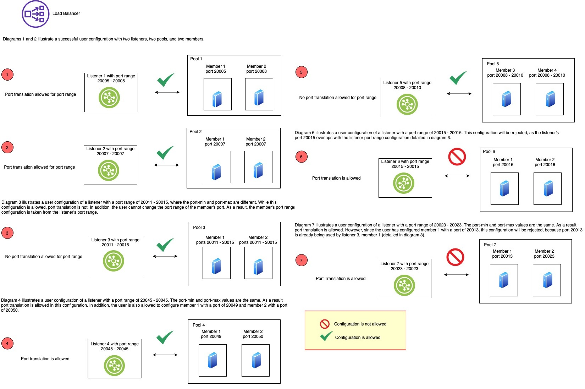

---

copyright:
  years: 2018, 2022
lastupdated: "2022-01-10"

keywords: port, range, nlb, configuring

subcollection: vpc

---

{{site.data.keyword.attribute-definition-list}}

# Setting public network load balancer port ranges
{: #nlb-port-ranges}

You can define the port range for the {{site.data.keyword.cloud}} {{site.data.keyword.nlb_full}} listener using the information in this topic.
{: shortdesc}

After you attach a pool to the listener, the back-end target has the same port range as the listener.
{: important}

The port range feature is not supported on private network load balancers. Only public NLBs can use this feature.
{: note}

## Configuring the port range using the UI
{: #port-range-ui}
{: ui}

You can configure the port range when [creating a network load balancer](/docs/vpc?topic=vpc-nlb-ui-creating-network-load-balancer),
or afterwards using the following procedure:

1. From your browser, open the [{{site.data.keyword.cloud_notm}} console](/login){: external} and log in to your account.

2. Select the Navigation Menu icon  from the upper left, then click **VPC Infrastructure > Load balancers**.

3. Click the NLB that you want to change.

4. From the NLB details page, select the Front-end listeners tab. Then select the listener that you want to edit.

   You can also click the **New Listener** button to create a new listener.
   {: tip}

   Using the **Port Min** and **Port Max** fields, specify the range of ports that receive your inbound customer traffic.

## Configuring the port range using the CLI
{: #port-range-cli}
{: cli}

You can configure the port range when [creating a network load balancer](/docs/vpc?topic=vpc-nlb-ui-creating-network-load-balancer&interface=cli) using the options:

* `--port-min PORT`
* `--port-max PORT`

## Configuring the port range using the API
{: #port-range-api}
{: api}

You can configure the port range when [creating a network load balancer](/docs/vpc?topic=vpc-nlb-ui-creating-network-load-balancer&interface=api) by specifying the `port-min` and `port-max` attributes in the listener creation payload.

## Port range limitations
{: #port-range-limitations}

The following limitations apply to network load balancer port ranges.

General limitations for Network Load Balancers can be seen [here](/docs/vpc?topic=vpc-nlb-limitations).
{: note}

1. If you specify the port range in the listener, then no port translation to the back-end member is allowed. For example, if the port range on the listener is 20001 - 20004, then every member associated to the pool behind this listener will have the ports 20001 - 20004.

2. If you enter the same port for both 'port_min' and 'port_max' in the listener, then port translation is allowed. This means you can configure a different member port.

3. The port ranges in the listeners for a specific NLB can not overlap. For example, a single NLB can not have a listener with a port range of 20001 - 20005 and a second listener with a port range of 20004 - 20006.

4. The member ID and member port must be unique and can not overlap. For example, a single NLB can not have the following configuration:

   * Listener A, with a port range of 20001 - 20005

   * Pool B, associated to listener A, that includes member C with a port range of 20001 - 20005

   * Listener D, with a single port of 20006

   * Pool E, associated to listener D, that includes member C with a single port of 20004

   Note that, member C uses port 20004 in two different listeners. This is not allowed.

   To help illustrate this limitation, refer to the following diagram.

   {: caption="Port range configuration" caption-side="bottom"}

5. When you enable a port range for the listener, the data traffic of its members will flow through all the ports in that range as well. If the pool health check port is not configured, the member port will only be used as a health check port.
