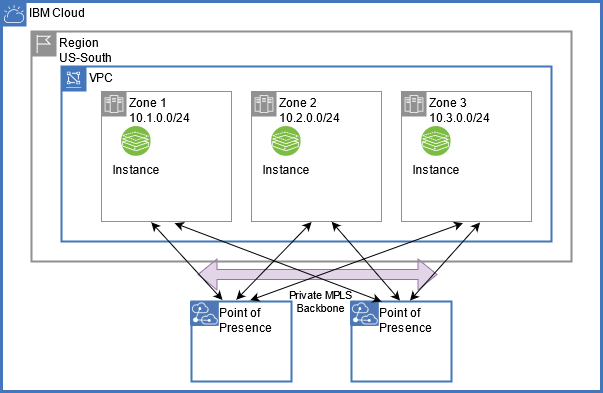
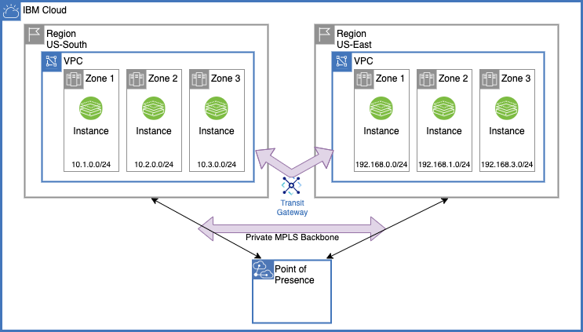

---

copyright:
  years: 2020, 2021
lastupdated: "2021-10-29"

keywords:  

subcollection: vpc

---

{:shortdesc: .shortdesc}
{:new_window: target="_blank"}
{:codeblock: .codeblock}
{:pre: .pre}
{:beta: .beta}
{:screen: .screen}
{:term: .term}
{:tip: .tip}
{:note: .note}
{:preview: .preview}
{:important: .important}
{:deprecated: .deprecated}
{:external: target="_blank_" .external}
{:generic: data-hd-programlang="generic"}
{:download: .download}
{:DomainName: data-hd-keyref="DomainName"}

# Private network connectivity within {{site.data.keyword.cloud_notm}}
{: #private-network-connectivity}

For technical, cost, regulatory and/or compliance reasons, you might require all connectivity to, within, and between your VPC infrastructures to be isolated from all public backbone and the internet.

The traffic between our data centers stays within our backbone and in our ASN. Traffic between our data centers does not traverse other networks (ASNs). This includes both public (front-end, internet-facing) and private (back-end) network traffic. {{site.data.keyword.IBM}} has a global backbone network that circles the globe.
{: note}

Example use cases of private connectivity include:

1. Instance to instance within an Availability Zone (AZ)
1. Instance to instance between AZs within a single region
1. Instance to instances region to region
1. Connection from a remote network (on-premises) to {{site.data.keyword.cloud}}

{{site.data.keyword.cloud_notm}} supports these topologies with:

* A private backbone for all connectivity between resources deployed in your VPC virtual networks with an AZ and between AZs (this backbone is separate from the public backbone for connectivity using public addressing). IP addresses on the private backbone are non-internet routable, or not announced toward the public backbone or the internet. The private backbone is owned, managed, and operated exclusively by {{site.data.keyword.cloud_notm}}.
* {{site.data.keyword.tg_full_notm}}, which meets use cases 1 through 3 by using this private backbone exclusively for connectivity between your virtual networks within a single region, across multiple regions, and to your {{site.data.keyword.cloud_notm}} classic workloads.
* {{site.data.keyword.dl_full_notm}} (2.0), which meets use case 4 by providing the ability to attach your remote networks (on-premises) to your virtual networks within {{site.data.keyword.cloud_notm}} VPC or {{site.data.keyword.cloud_notm}} classic via this same private backbone.

By default, a VPC is private, and remains private until it is configured to enable public connectivity. For instance, a VPC might be connected to a public gateway or associated with floating IPs.
{: note}

## Architecture
{: #private-network-arch}

### Single-region, multi-zone VPC virtual network
{: #single-region-multi-zone}

### Multi-region, multi-zone VPC virtual networks
{: #multi-region-multi-zone}

### Connection from a remote network (on-premises) to {{site.data.keyword.cloud_notm}}
{: #direct-link-use-case}

### Connecting to Hyper Protect Crypto Services (HPCS) from VPC by using a Private Network
{: #vpc_privatenetwork_hpcs}

The HPCS instance can be configured using API requests from both public and private endpoints. You can route traffic from your virtual server instance to the HPCS instance via the private network by configuring the route. You can use the `route add -net 166.9.0.0/16 gw <gateway> dev <gateway_interface>` command to configure the route. For more information about configuring the private network of {{site.data.keyword.cloud_notm}} on your virtual server, see [Using service endpoints to privately connect to Hyper Protect Crypto Services](/docs/hs-crypto?topic=hs-crypto-secure-connection#configure-network).

See [{{site.data.keyword.tg_full_notm}}](/docs/transit-gateway?topic=transit-gateway-about) and [{{site.data.keyword.dl_full_notm}} (2.0)](/docs/dl?topic=dl-get-started-with-ibm-cloud-dl) use case documentation for detailed private connectivity use cases and topologies. For information about native, private connectivity to {{site.data.keyword.cloud_notm}} services, see [Endpoints available](/docs/vpc?topic=vpc-service-endpoints-for-vpc).
