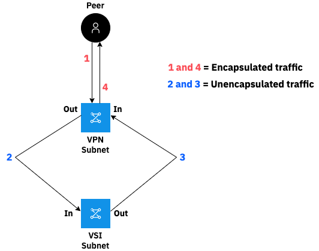

---

copyright:
  years: 2020, 2023
lastupdated: "2023-01-30"

keywords:  VPN, network, encryption, authentication, algorithm, IKE, IPsec, policies, gateway

subcollection: vpc

---

{{site.data.keyword.attribute-definition-list}}

# Configuring ACLs and security groups for use with VPN
{: #acls-security-groups-vpn}

Access control lists (ACLs) and security groups can be configured on the VPN gateway's subnet where the VPN gateway is deployed, and other VPC subnets that communicate over the VPN tunnel.

The following diagram illustrates packet flow through VPC network ACLs. 

   {: caption="Figure 1. Packet flow through VPC ACLs" caption-side="bottom"}

Encapsulated, bidirectional traffic flows from the peer gateway (1) to the VPC resources that are a part of the encrypted domain. Unencapsulated packets then leave the VPN subnet and enter the VSI subnet (2). They travel back to the VPN subnet (3), where they then return to the peer gateway (4).

If you configure ACLs or security groups on the VPN gateway's subnet, make sure that the following rules are in place to allow management traffic and VPN tunnel traffic. For more information, see [Setting up network ACLs](/docs/vpc?topic=vpc-using-acls) and [About security groups](/docs/vpc?topic=vpc-using-security-groups).

| Inbound/Outbound Rules | Protocol | Source IP | Source Port | Destination IP | Destination Port |
|--------------|------|------|------|------|------------------|
| Inbound | All | Peer gateway public IP[^IP] | N/A | VPN gateway's subnet | N/A
| Outbound | All  | VPN gateway's subnet | N/A | Peer gateway public IP[^IP2] | N/A
| Inbound | All | On-premises, private CIDR | N/A | VPC CIDR | N/A
| Outbound | All  | VPC CIDR | N/A | On-premises, private CIDR | N/A
| Inbound | All  | VPC CIDR | N/A | On-premises, private CIDR | N/A
| Outbound | All | On-premises, private CIDR | N/A | VPC CIDR | N/A
| Inbound (optional) | ICMP | Any | N/A | Any | N/A
{: caption="Table 1. Inbound and outbound rules on VPN gateway's subnet" caption-side="bottom"}

If you use ACLs or security groups on the VPC subnets that communicate over the VPN tunnel, make sure that ACL or security group rules are in place to allow traffic between virtual server instances in your VPC and the other network.
{: important}

| Inbound/Outbound Rules | Protocol | Source IP | Source Port | Destination IP | Destination Port |
|--------------|------|------|------|------|------------------|
| Inbound | All | On-premises, private CIDR | N/A | VPC CIDR | N/A
| Outbound | All | VPC CIDR | N/A | On-premises, private CIDR | N/A
{: caption="Table 2. Inbound and outbound rules on VPC subnets" caption-side="bottom"}

[^IP]: Set the source IP to the peer gateway public IP address. This setting allows traffic from the VPC and the on-premises subnets.

[^IP2]: Set the source IP to the peer gateway public IP address. This setting allows traffic from the VPC and the on-premises subnets.

## Rules for VPN traffic using NACLs
{: #rules-vpn-traffic-using-nacls}

Two kinds of NACL exist; the first is attached to a subnet that you choose to create the VPN gateway, the second is attached to a subnet that you choose to create the virtual server instance.

### NACL attached to the subnet that you chose to create the VPN gateway
{: #nacl-vpn-gateway}

The following rules apply to NACLs attached to subnets that you choose to create the VPN gateway.

#### Rules scenario 1
{: #rules-1}

Inbound/Outbound Rules|Protocol| Source IP| Destination|
|---------------------|--------|----------|------------|
|Inbound |ALL |Your on-premises gateway public IP|Subnet CIDR that you choose to create the VPN gateway.|
|Outbound |ALL |Subnet CIDR that you choose to create the VPN gateway|Your on-premises gateway public IP.|
{: caption="Table 3. Rules1: Allow IPsec protocol packet between IBM gateway and your on-premises gateway" caption-side="bottom"}

#### Rules scenario 2
{: #rules-2}

Inbound/Outbound Rules|Protocol| Source IP| Destination|
|---------------------|--------|----------|------------|
|Inbound |ALL |Your on-premises subnets|Subnet CIDR that you choose to create the VPC virtual server instance.|
|Outbound |ALL |Subnet CIDR in which you choose to create the VPC virtual server instance|Your on-premises subnets.|
{: caption="Table 4. Rules2: Allow traffic between your on-premises private and VPC subnet in which you chose to create the virtual server instance" caption-side="bottom"}

#### Rules scenario 3
{: #rules-3}

Allow ICMP to the VPN gateway for troubleshooting. (Optional)

### NACL attached to create the virtual server instance
{: #nacl-vsi}

Same as [table 4](#rules-2). 
