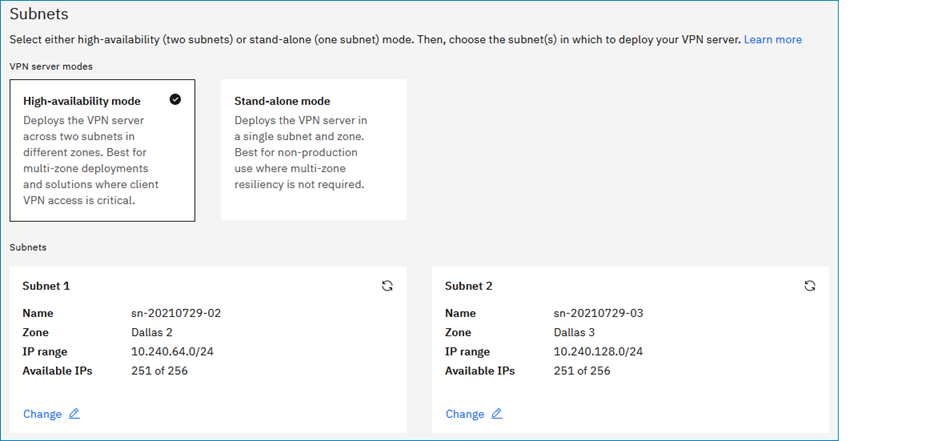
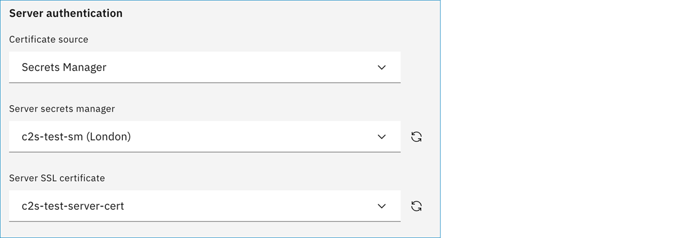
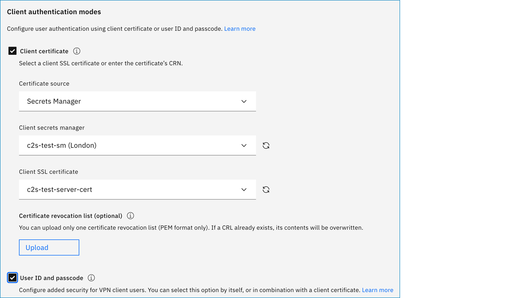
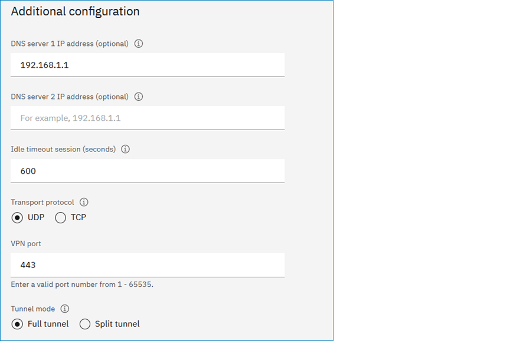

---

copyright:
  years: 2021
lastupdated: "2021-08-26"

keywords:  

subcollection: vpc

---

{:shortdesc: .shortdesc}
{:new_window: target="_blank"}
{:codeblock: .codeblock}
{:pre: .pre}
{:screen: .screen}
{:term: .term}
{:note: .note}
{:tip: .tip}
{:important: .important}
{:external: target="_blank_" .external}
{:generic: data-hd-programlang="generic"}
{:download: .download}
{:DomainName: data-hd-keyref="DomainName"}
{:help: data-hd-content-type='help'}
{:support: data-reuse='support'}
{:ui: .ph data-hd-interface='ui'}
{:cli: .ph data-hd-interface='cli'}
{:api: .ph data-hd-interface='api'}

# Creating a VPN server (Beta)
{: #vpn-create-server}
{: help}
{: support}

Create a VPN server to allow clients from the internet to connect to the VPC network while maintaining secure connectivity.
{: shortdesc}

You can create a VPN server by using the UI, CLI, or API.

## Before you begin
{: #vpn-client-to-site-prerequisites}

Before you provision a VPN server, complete the following prerequisites in the following order:

1. Review [Planning considerations for VPN servers](/docs/vpc?topic=vpc-client-to-site-vpn-planning).
1. Decide which VPN client authentication that you want to use: certificate-based, user ID and passcode, or both. For more information, see [Setting up client-to-site authentication](/docs/vpc?topic=vpc-client-to-site-authentication).
1. For user ID and passcode authentication only, [create an IAM access group and grant users the role to connect to the VPN server](/docs/vpc?topic=vpc-create-iam-access-group).
1. [Create a certificate manager instance and import certificates](/docs/vpc?topic=vpc-client-to-site-authentication#creating-cert-manager-instance-import).
1. For server authentication only, [create IAM service-to-service authorization](/docs/vpc?topic=vpc-client-to-site-authentication#creating-iam-service-to-service).
1. Depending on the deployment mode that you selected for your VPN server, do one of the following:

   * For a High Availability (HA) VPN server, create a VPC and two subnets in two different zones. The VPN server resides in the two subnets.   
   * For a stand-alone VPN server, create a VPC and one subnet in one zone.
   
   For instructions, see [Creating a VPC and subnet](/docs/vpc?topic=vpc-creating-a-vpc-using-the-ibm-cloud-console#creating-a-vpc-and-subnet).
   {: note}

1. Optionally, if you plan to configure access control lists (ACLs) for use with the VPN, see [Configuring security groups and ACLs for use with VPN](/docs/vpc?topic=vpc-vpn-client-to-site-security-groups).

   To configure security groups for use with a VPN, you must do so during VPN server provisioning ([VPN server limitation](/docs/vpc?topic=vpc-vpn-client-vpn-limitations)). At least one security group is required.
   {: important}         

## Creating a VPN server using the UI
{: #creating-vpn-server-ui}
{: ui}

To create a client-to-site VPN server using the UI:

1. Complete all prerequisites in the "Before you begin" section.
1. From your browser, open the [{{site.data.keyword.cloud_notm}} console](https://cloud.ibm.com){: external} and log in to your account.
1. Select the Menu icon  on the upper left of the page, then click **VPC Infrastructure > VPNs** in the Network section.

    If starting from the VPC Infrastructure menu, click **VPN gateways** in the Network section to open the {{site.data.keyword.vpn_vpc_short}} page.
    {: tip}

1. Click **Create** in the upper right of the page.
1. In the VPN type section, click **Client-to-site server**.

   
1. In the Details section, specify the following information:

   * **VPN server name** - Enter a name for the VPN server, such as `my-vpn-server`.
   * **Resource group** - Select a resource group for the VPN server.
   * **Region** - Shows the region where the VPC is located and where the VPN server will be provisioned.
   * **Virtual Private Cloud** - Select the VPC for the VPN server.
   * **Client IPv4 address pool** - Enter a CIDR range. The client is assigned an IP address for its session from this address pool.

      
1. In the Subnets section, specify the following information:

   * Select a VPN server mode:

      * High-availability mode - Deploys the VPN server across two subnets in different zones. Best for multi-zone deployments and solutions where client VPN access is critical.
      * Stand-alone mode - Deploys the VPN server in a single subnet and zone. Best for single-zone deployments where multi-zone resiliency is not required.

   * Specify the subnet (stand-alone mode) or subnets (HA mode) for your VPC.
   
      

1. In the Authentication section, specify the following information:

   * **VPN server authentication** - Select the server certificate manager and server SSL certificate.   
   
      
   * **Client authentication modes** - Select to configure user authentication through the use of a client certificate, user ID and passcode, or both.   

      * Client certificate - You can select a client certificate and configure a user ID and passcode for optimal security. A user ID and passcode provides two-factor authentication, which is an added layer of security that requires additional login credentials for account access.

         Optionally, you can upload a Certificate Revocation List (CRL) in PEM format. After you upload a CRL, the PEM file shows as the name of the VPN server.
         {: note}

      * User ID and passcode - Configure Two-Factor Authentication (2FA) for your account. 2FA offers an added layer of security that integrates with IBM Cloud IAM to complete the 2FA authentication. When 2FA is completed, the system passes the code to the openVPN client for authentication.
   
      
      
1. In the Security groups section, select at least one security group. To configure one or more security groups and their rules, see [Configuring ACLs and security groups for use with VPN](/docs/vpc?topic=vpc-acls-security-groups-vpn).

   Currently, you can attach security groups only during VPN server provisioning.
   {: note}
   
   

1. In the **Additional configuration** section, specify the following information:

   * **DNS server IP address** - Optionally, specify one or two DNS server IP addresses for domain name resolution.
   * **Idle timeout session (seconds)** - If the VPN server has no traffic before this interval lapses, it is automatically disconnected. This value can range between `0` to `28800` seconds. The default value is `600` seconds.
   * **Transport protocol** - Select one of the following protocols and enter a valid VPN port (`1 - 65535`).

      * UDP is a connectionless protocol that performs error checking but discards erroneous packets. Faster than TCP.
      * TCP is a connection-oriented protocol with error checking and error recovery. More reliable than UDP.
   * **Tunnel mode** - Specify one of the following:

      * Full tunnel - All traffic flows through the VPN interface to the VPN tunnel.   
      * Split tunnel - Private traffic flows through the VPN interface to the VPN tunnel, and public traffic flows through the existing LAN interface.
      
         

## Creating a VPN server using the CLI
{: #vpn-create-server-cli}
{: cli}

To create a VPN server by using the CLI, enter the following command:

```
ibmcloud is vpn-server-create --subnets SUBNETS --client-ip-pool CLIENT_IP_POOL --cert CERT (--client-auth-methods certificate | username | certificate,username | username,certificate) [--client-ca CLIENT_CA] [--client-crl CLIENT_CRL] [--client-dns CLIENT_DNS] [--client-idle-timeout CLIENT_IDLE_TIMEOUT] [--enable-split-tunnel false | true] [--port PORT] [--protocol udp | tcp] [--security-group SECURITY_GROUP1 --security-group SECURITY_GROUP2 ...] [--name NAME] [--resource-group-id RESOURCE_GROUP_ID | --resource-group-name RESOURCE_GROUP_NAME] [--output JSON] [-q, --quiet]
```
{: pre}

### Command options
{: #vpn-command-options}

- **--subnets**: Comma-separated IDs of the subnets to provision this VPN server in. Use subnets in different zones for high availability, two subnets can be set at most.
- **--client-ip-pool**: The VPN client IPv4 address pool, expressed in CIDR format. The request must not overlap with any existing address prefixes in the VPC or any of the following reserved address ranges: 127.0.0.0/8 (IPv4 loopback addresses), 161.26.0.0/16 (IBM services), 166.8.0.0/14 (Cloud Service Endpoints), 169.254.0.0/16 (IPv4 link-local addresses), 224.0.0.0/4 (IPv4 multicast addresses). The prefix length of the client IP address pool's CIDR must be between /9 (8,388,608 addresses) and /22 (1024 addresses). A CIDR block that contains twice the number of IP addresses that are required to enable the maximum number of concurrent connections is recommended.
- **--cert**: The certificate instance CRN for this VPN server.
- **--client-auth-methods**: Comma-separated list of client authentication methods. One of: **certificate**, **username**, **certificate,username**, **username,certificate**.
- **--client-ca**: The CRN of the certificate instance to use for the VPN client certificate authority (CA).
- **--client-crl**: CRL | @CRL-file. The certificate revocation list contents, encoded in PEM format.
- **--client-dns**: Comma-separated of DNS server addresses that will be provided to VPN clients connected to this VPN server. Two DNS servers can be set at most.
- **--client-idle-timeout**: The seconds a VPN client can be idle before this VPN server will disconnect it. Specify 0 to prevent the server from disconnecting idle clients (default: **600**).
- **--enable-split-tunnel**: Indicates whether the split tunneling is enabled on this VPN server. One of: **false**, **true** (default: **false**).
- **--port**: The port number to use for this VPN server (default: **443**).
- **--protocol**: The transport protocol to use for this VPN server. One of: **udp**, **tcp** (default: **udp**).
- **--security-group**: ID of the security group.
- **--name**: New name for the vpn server.
- **--resource-group-id**: ID of the resource group. This option is mutually exclusive with **--resource-group-name**.
- **--resource-group-name**: Name of the resource group. This option is mutually exclusive with **--resource-group-id**.
- **--output**: Specify output format, only JSON is supported. One of: **JSON**.
- **-q, --quiet**: Suppress verbose output.

### Command examples
{: #command-examples-vpn-server-create}

- `ibmcloud is vpn-server-create --subnets 0726-a7191f77-7c87-4ad4-bb11-a37f9e9fc0f0,0736-4b871e22-e819-4f87-bb17-e457a88246a2 --cert crn:v1:bluemix:public:cloudcerts:us-south:a/aa5a471f75bc456fac416bf02c4ba6de:1862b0b4-c1f8-4eef-a6b5-e9c00c9f593d:certificate:6c801ef768c139d986b4c6f91175e8cc --client-ip-pool 190.165.7.0/20 --client-auth-methods certificate --client-ca crn:v1:staging:public:cloudcerts:us-south:a/aa5a471f75bc456fac416bf02c4ba6de:1862b0b4-c1f8-4eef-a6b5-e9c00c9f593d:certificate:6c801ef768c139d986b4c6f91175e8cc`
- `ibmcloud is vpn-server-create --name myvpnserver --subnets 0726-a7191f77-7c87-4ad4-bb11-a37f9e9fc0f0,0736-4b871e22-e819-4f87-bb17-e457a88246a2 --cert crn:v1:bluemix:public:cloudcerts:us-south:a/aa5a471f75bc456fac416bf02c4ba6de:1862b0b4-c1f8-4eef-a6b5-e9c00c9f593d:certificate:6c801ef768c139d986b4c6f91175e8cc --client-ip-pool 190.166.7.0/20 --client-auth-methods username`
- `ibmcloud is vpn-server-create --name myvpnserver2 --subnets 0726-a7191f77-7c87-4ad4-bb11-a37f9e9fc0f0 --cert crn:v1:bluemix:public:cloudcerts:us-south:a/aa5a471f75bc456fac416bf02c4ba6de:1862b0b4-c1f8-4eef-a6b5-e9c00c9f593d:certificate:6c801ef768c139d986b4c6f91175e8cc --client-ip-pool 190.167.7.0/20 --client-auth-methods username --client-dns 9.9.9.9,8.8.8.8 --protocol tcp --port 8888 --enable-split-tunnel true --client-idle-timeout 1200`
- `ibmcloud is vpn-server-create --name myvpnserver3 --subnets 0726-a7191f77-7c87-4ad4-bb11-a37f9e9fc0f0 --cert crn:v1:bluemix:public:cloudcerts:us-south:a/aa5a471f75bc456fac416bf02c4ba6de:1862b0b4-c1f8-4eef-a6b5-e9c00c9f593d:certificate:6c801ef768c139d986b4c6f91175e8cc --client-ip-pool 190.168.7.0/20 --client-auth-methods username --security-group r134-e32f671c-463d-4f93-88e3-2dd0413476b4 --security-group r134-3af7a9db-d9bc-43d4-bced-93e0a33fee25`
- `ibmcloud is vpn-server-create  --subnets 0736-4b871e22-e819-4f87-bb17-e457a88246a2 --client-ip-pool 192.170.0.0/22 --client-dns 172.34.1.100 --cert crn:v1:bluemix:public:cloudcerts:us-south:a/0046b57b897f419080c4ed3e011b86d4:5f1a72bc-b4c2-413f-bd22-011cfa4be5db:certificate:c81627a1bf6f766379cc4b98fd21ccd6 --client-auth-methods certificate,username --client-ca crn:v1:bluemix:public:cloudcerts:us-south:a/0046b57b897f419080c4ed3e011b86d4:5f1a72bc-b4c2-413f-bd22-011cfa4be5db:certificate:c81627a1bf6f766379cc4b98fd21ccd6 --client-crl @./openvpn/crl.pem --name vpnswithcrl --security-group r134-5744b689-e5c4-461d-9f9b-ce5e7e8dbed6`

## Creating a VPN server using the API
{: #vpn-create-server-api}
{: api}

To create a client-to-site VPN server by using the API, follow these steps:

1. Set up your [API environment](/docs/vpc?topic=vpc-set-up-environment#api-prerequisites-setup) with
the right variables.
1. Store any additional variables to be used in the API commands; for example:

   * `ResourceGroupId` - Find the resource group ID by using the `get resource groups` command and then populate the variable:

      ```sh
      export ResourceGroupId=<your_resourcegroup_id>
      ```
      {: pre}

   * `SubnetId` - Find the subnet ID by using the `get subnet` command and then populate the variable:
   
      ```sh
      export SubnetId=<your_subnet_id>
      ```
      {: pre}

1. When all variables are initiated, create the VPN server:

   ```sh
      curl -X POST "$vpc_api_endpoint/v1/vpn_servers?version=$api_version&maturity&generation=2" \
        -H "Authorization: $iam_token" \
        -d '{
           "certificate": {
               "crn": "crn:v1:staging:public:cloudcerts:us-south:a/aa5a471f75bc456fac416bf02c4ba6de:1862b0b4-c1f8-4eef-a6b5-e9c00c9f593d:certificate:6c801ef768c139d986b4c6f91175e8cc"
            },
           "client_ip_pool": "192.168.50.0/22",
           "name": "my-new-vpn-server",
           "subnets": [
               {
                     "id": "0716-046c3fd3-1cc5-40f6-b0ad-bbc305308f6d"
               },
               {
                     "id": "0726-30ff71ff-3e90-42a9-aa93-96a062081f18"
               }
            ],
           "client_authentication": [
               {
                     "method": "certificate",
                     "client_ca": {
                        "crn": "crn:v1:staging:public:cloudcerts:us-south:a/aa5a471f75bc456fac416bf02c4ba6de:1862b0b4-c1f8-4eef-a6b5-e9c00c9f593d:certificate:6c801ef768c139d986b4c6f91175e8cc"
                     }
               },
               {
                     "method": "username",
                     "identity_provider": {
                        "provider_type": "iam"
                     }
               }
            ]
           "resource_group": {
             "id": "'$ResourceGroupId'"
           }
         }'
   ```
   {: codeblock}

## Next steps
{: #next-steps-after-provisioning-vpn-server}

1. To validate that the VPN server was created successfully, wait a few minutes and then go to the [Client-to-site servers](https://cloud.ibm.com/vpc-ext/network/vpnServers){: external} table to ensure that the VPN server status is `Stable` and the Health status is `Healthy`.
1. [Create VPN routes](/docs/vpc?topic=vpc-vpn-client-to-site-routes).
1. [Set up a VPN client environment and connect to the VPN server](/docs/vpc?topic=vpc-vpn-client-environment-setup).
