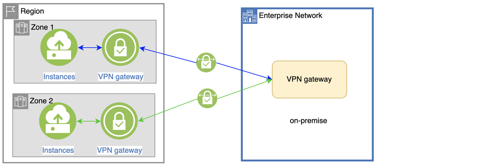

---

copyright:
  years: 2022, 2024 2024
lastupdated: "2024-09-10"

keywords: VPN, VPN gateways, HA, High availability, Redundancy

subcollection: vpc

---

{{site.data.keyword.attribute-definition-list}}

# VPN gateway high availability
{: #vpn-ha}

## VPN gateway high availability in a single-zone
{: #vpn-ha-in-single-zone}

A VPN gateway consists of two back-end instances in the same zone for high availability. The VPN service monitors the back-end instances and fails over when the back-end instance is down. VPN routine maintenance is performed with rolling upgrade of the two back-end instances. During the maintenance, you might see a VPN private IP address change. The VPN public IP addresses are not impacted and your VPN connections are switched over to the available instance automatically.

{: caption="Figure 1. VPN gateway HA in single zone" caption-side="bottom"}

## VPN gateway high availability in a Multizone region
{: #vpn-gateway-ha-in-multiple-zones}

When a network outage occurs in a [zone](#x2070723){: term}, you might lose network access to all resources, including the VPN gateway in that zone. It is recommended to spread your workload across zones with a VPN gateway in each zone, and load-balance between zones to achieve high availability.

Figure 2 describes how to spread your workload in [multizone regions](#x9774820){: term}. Each VPN gateway in the zone is to be used to access only the VPC network in the same zone.

{: caption="Figure 2. VPN gateway HA in multiple zones" caption-side="bottom"}
