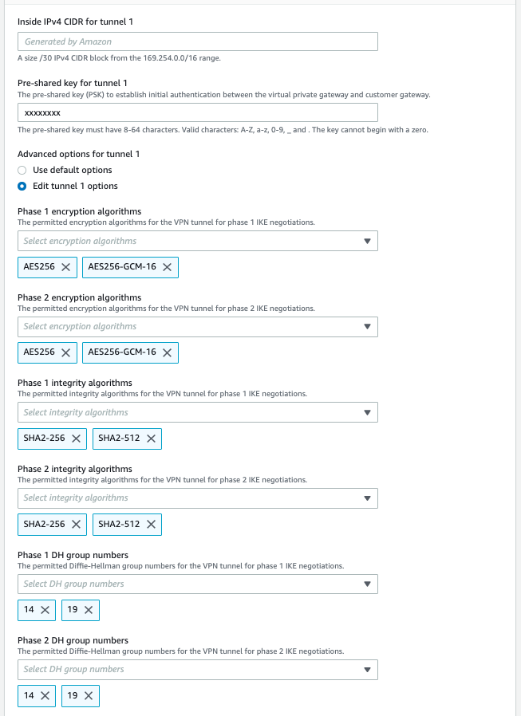
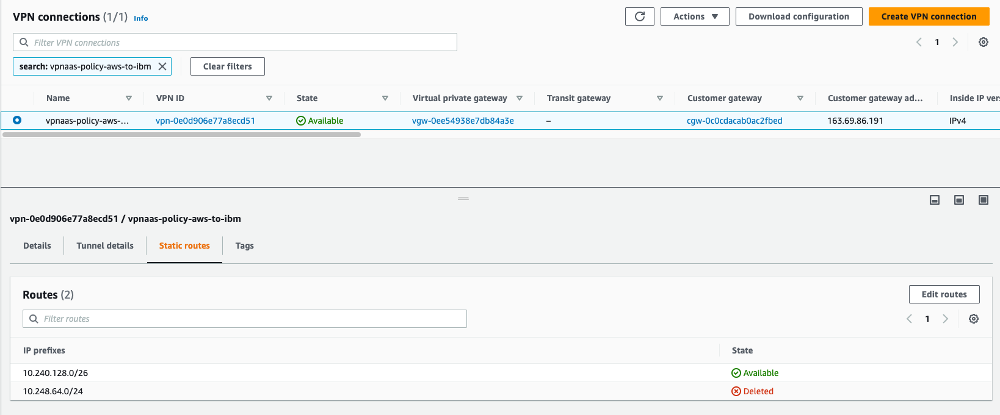

---

copyright:
  years: 2020
lastupdated: "2020-09-07"

keywords: aws, aws peer, vpn aws

subcollection: vpc

---

{:shortdesc: .shortdesc}
{:codeblock: .codeblock}
{:screen: .screen}
{:important: .important}
{:new_window: target="_blank"}
{:pre: .pre}
{:tip: .tip}
{:note: .note}
{:table: .aria-labeledby="caption"}
{:download: .download}

# Connecting to an AWS peer
{: #aws-config}

You can use {{site.data.keyword.cloud}} VPN for VPC to securely connect your VPC to an on-premises network through a VPN tunnel. This topic provides guidance about how to configure your AWS VPN gateway to connect to VPN for VPC.
{: shortdesc}

Because AWS requires PFS to be _enabled_ in Phase 2, you must create a custom IPsec policy to replace the default policy for the VPN in your VPC. See [Creating a custom IPsec policy in VPN for VPC](/docs/vpc?topic=vpc-creating-ipsec-policy) for more details.
{: important}

When the AWS VPN receives a connection request from VPN for VPC, AWS VPN uses IPsec Phase 1 parameters to establish a secure connection and authenticate the VPN for VPC gateway. Then, if the security policy permits the connection, the AWS VPN establishes the tunnel by using IPsec Phase 2 parameters and applies the IPsec security policy. Key management, authentication, and security services are negotiated dynamically through the IKE protocol.

To support these functions, the following general configuration steps must be performed on the AWS VPN:

* Define the Phase 1 parameters that the AWS VPN requires to authenticate the remote peer and establish a secure connection.
* Define the Phase 2 parameters that the AWS VPN requires to create a VPN tunnel with VPN for VPC.

## Connecting an IBM policy-based VPN to an AWS peer
{: #aws-config-policy-based}

VPN for VPC policy-based VPN can be used to connect to AWS route-based VPN. However, policy-based VPNs require separate SAs (Security Associations) for each subnet, while route-based VPNs use a single SA for all encrypted traffic. Therefore, connection between a policy-based VPN to a route-based VPN is limited to one SA associated with a single CIDR range.
{: important}

If you have multiple subnets with contiguous address range, you can create connection with a CIDR that is a superset of your subnets. For example: `192.168.0.0/24` and `192.168.1.0/24` are covered by CIDR `192.168.0.0/23`
{: tip}

### Configuring AWS
{: #aws-to-policy-based-aws-config}

To configure an AWS peer, follow these steps:

1. Create an AWS Customer Gateway using the IBM policy-based VPN IP address.
1. Create an AWS Virtual Private Gateway and attach it to the AWS VPC that must send traffic to the IBM VPC.
1. Create a single AWS site-to-site connection:
   * Set the **Virtual Private Gateway** to the gateway created in step 2.
   * Set the **Customer Gateway** to the customer gateway created in step 1.
   * Set **Routing Option** to **Static**.
   * Add the single CIDR on IBM side to **Static IP Prefixes** .
     To reach multiple contiguous subnets in IBM VPC, use a larger CIDR range that covers all subnets that are needed.
   * Enter a pre-shared key for both **tunnel1** and **tunnel2**.
   * For both AWS tunnels, choose **Edit Tunnel X Options** and select the desired security parameters. You can choose multiple values for each parameter as long as they are supported by IBM VPN as well.
     
1. After the AWS site-to-site connection is in `Available` state, go to the **Static Routes** tab to verify that the correct route was added automatically. Make manual adjustments if necessary.
   The following screen shows networks `10.240.128.0/27` and `10.240.128.32/27` on the IBM VPC side are routed with new destination `10.240.128.0/26`.
      
1. Go to AWS **Route Tables** under **VIRTUAL PRIVATE CLOUD**, find the route table that is associated with the VPC where the VPN was attached. Click **Edit Routes** and add the same route to route table.
   [AWS Route Table](images/vpn-aws-route-table.png)
1. Verify connection status on the **Site-to-Site Connection** page.
1. Verify traffic. Ensure that AWS ACL and security group rules are adjusted to allow the traffic you need.

### Configuring the policy-based IBM Cloud VPN
{: #aws-to-policy-based-ibm-config}

To configure an IBM Cloud policy-based VPN for an AWS peer:

1. Create two new connections, one for each AWS tunnel IP. Use single CIDR for both **Local Subnets** and **Peer Subnets**.
   Because AWS requires PFS to be _enabled_ in Phase 2, you must create a custom IPsec policy to replace the default policy for the VPN in your VPC. For more information, see [Creating a custom IPsec policy in VPN for VPC](/docs/vpc?topic=vpc-creating-ipsec-policy).
   {: important}
1. After status for both connections show **Active**, verify traffic between your subnets.
