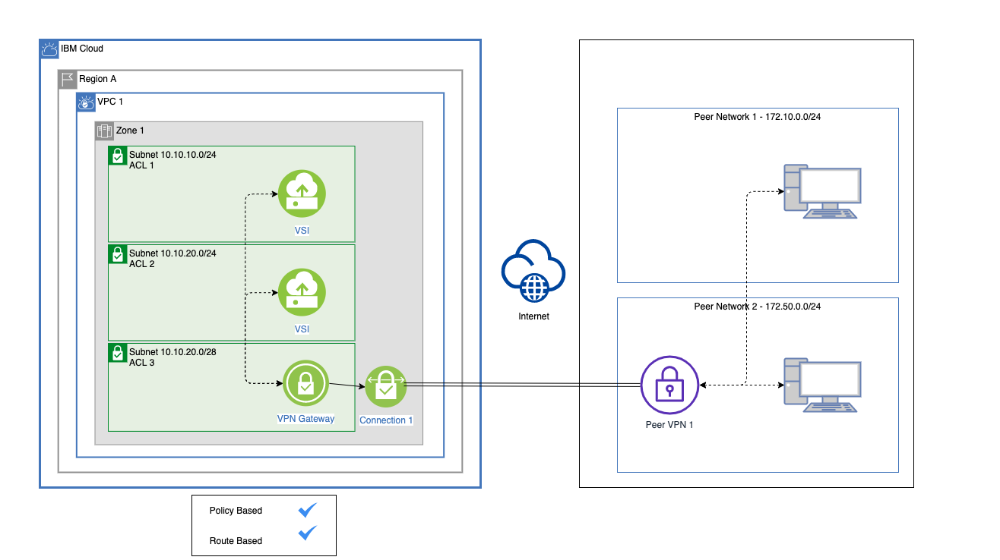
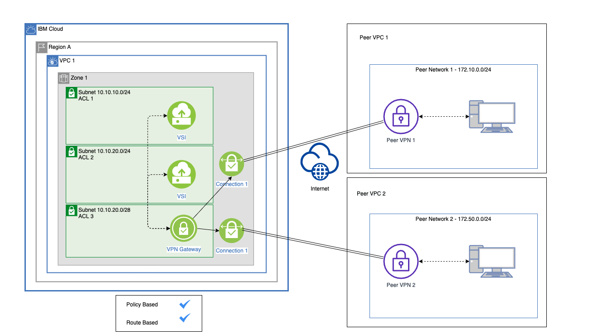

---

copyright:
  years: 2019, 2020
lastupdated: "2020-11-13"

keywords: VPN, VPN gateways, encryption, IKE, IPsec, gateway, auto-negotiation, Diffie-Hellman, dead peer detection, PFS

subcollection: vpc

---

{:shortdesc: .shortdesc}
{:new_window: target="_blank"}
{:codeblock: .codeblock}
{:pre: .pre}
{:screen: .screen}
{:important: .important}
{:tip: .tip}
{:note: .note}
{:download: .download}
{:DomainName: data-hd-keyref="DomainName"}
{:external: target="_blank" .external}

# About VPN gateways
{: #using-vpn}
[comment]: # (linked help topic)

You can use the {{site.data.keyword.cloud}} {{site.data.keyword.vpn_vpc_short}} service to securely connect your Virtual Private Cloud (VPC) to another private network. Use a static, route-based VPN or a policy-based VPN to set up an IPsec site-to-site tunnel between your VPC and your on-premises private network, or another VPC.
{: shortdesc}

Route-based VPN is now available in addition to policy-based VPN. To get started, select **Route-based** as the mode when creating a VPN gateway and [create routes](/docs/vpc?topic=vpc-create-vpc-route) using the VPN connection type.
{: note}

## VPN features
{: #vpn-features}

The {{site.data.keyword.cloud_notm}} {{site.data.keyword.vpn_vpc_short}} service includes the following features:

* **IPsec** - Protocol suite that provides secure communication between devices. {{site.data.keyword.cloud_notm}} {{site.data.keyword.vpn_vpc_short}} uses Encapsulating Security Protocol (ESP) in tunnel mode, which offers authentication and entire packet encryption.
* **Internet Key Exchange (IKE)** - IKE is a part of the IPsec protocol used to establish VPN connections. In IKE Phase 1, VPN peers use Diffie-Hellman (DH) key exchange to create a secure, authenticated communication channel. In IKE Phase 2, the peers use the secure channel from Phase 1 to negotiate parameters for IPsec tunnel. {{site.data.keyword.cloud_notm}} {{site.data.keyword.vpn_vpc_short}} supports both IKEv1 (main mode) and IKEv2. See [About policy negotiation](#policy-negotiation) for the supported combinations.
* **Authentication** - {{site.data.keyword.cloud_notm}} {{site.data.keyword.vpn_vpc_short}} supports a pre-shared key for Phase 1 peer authentication. Supported authentication algorithms for both phases include MD-5, SHA-1, and SHA-256.
* **Encryption** - {{site.data.keyword.cloud_notm}} {{site.data.keyword.vpn_vpc_short}} supports 3-DES, AES-128, and AES-256 for data encryption during both IKE Phase 1 and Phase 2.
* **Diffie-Hellman (DH)** - Key exchange protocol used in Phase 1 to generate a shared secret key between VPN peers. Optionally, users can enable Perfect Forward Secrecy (PFS) and a DH Group for Phase 2 IPsec negotiation. {{site.data.keyword.cloud_notm}} {{site.data.keyword.vpn_vpc_short}} supports DH Groups 2, 5, and 14.
* **Perfect Forward Secrecy (PFS)** - PFS ensures DH-generated keys are not used again during IPsec renegotiation. If a key is compromised, only data in transit during the protected security association's lifetime is accessible.
* **Dead Peer Detection** - Configurable mechanism to detect availability of an IPsec peer.
* **Modes** - {{site.data.keyword.cloud_notm}} {{site.data.keyword.vpn_vpc_short}} offers static, route-based and policy-based VPN modes. With a policy-based VPN, traffic that matches negotiated CIDR ranges are encrypted. For a static, route-based VPN, virtual tunnel interfaces are created and any traffic that is routed towards these logical interfaces with custom routes is encrypted. Both VPN flavors provide the same features.  
* **High availability** - {{site.data.keyword.cloud_notm}} {{site.data.keyword.vpn_vpc_short}} is built on two VPN devices to provide appliance-level redundancy. A policy-based VPN operates in Active-Standby mode with a single VPN gateway IP shared between the members, while a route-based VPN offers Active-Active redundancy with two VPN gateway IPs.

  Currently, a static, route-based VPN does not support redundant connections to peer networks through multiple peer IPs. You can create multiple VPN connections for different peer IPs for each set of peer networks. However, only one connection can be used as next hop for each peer CIDR block.
  {: important}

## Getting started with VPN gateways
{: #vpn-getting-started}

Before you create a VPN, you must first [create a VPC and one or more subnets](/docs/vpc?topic=vpc-getting-started) for your VPN and other resources.

  Although not required, it is recommended to dedicate a subnet of at least 16 IPs (prefix 28 or lower) for your VPN gateway. If you decide to provision additional resources within the VPN subnet, make sure that there are always at least 4 IPs available for recovery and maintenance tasks for use by the VPN gateway. In addition to the 4 IPs needed by the VPN gateway, up to 5 IPs in a subnet are reserved by internal network use so make sure the subnet is big enough.
  {: tip}

To get started creating a VPN gateway, follow these general steps:

1. Make sure the [ACLs and security groups](/docs/vpc?topic=vpc-acls-security-groups-vpn) for VPN traffic to flow are in place.
1. Ensure that your peer device supports NAT Traversal and is enabled on the peer device. For more information, see [VPN gateway limitations](/docs/vpc?topic=vpc-vpn-limitations).
1. Review planning considerations and [create your VPN gateway](/docs/vpc?topic=vpc-vpn-create-gateway).
1. [Create VPN connections](/docs/vpc?topic=vpc-vpn-adding-connections).

   {{site.data.keyword.vpn_vpc_short}} supports only one route-based VPN per zone per VPC.
   {: note}

1. For static, route-based VPNs, select or [create a routing table for static routing](/docs/vpc?topic=vpc-create-vpc-routing-table), then [create routes](/docs/vpc?topic=vpc-create-vpc-route) using the **VPN connection** type.
1. [Connect to a on-premises network through a VPN tunnel](/docs/vpc?topic=vpc-vpn-onprem-example).
1. Verify your VPN connection by sending ping or data traffic across the tunnel to devices on the peer network.

## Architecture
{: #vpn-architecture-diagram}

This diagram illustrates an example VPN setup with multiple on-premise networks. The VPN is configured on a subnet within a user's VPC, but can be shared by instances on all subnets within the zone. The IKE and IPsec policies also can be used by one or more VPN connections.

## {{site.data.keyword.vpn_vpc_short}} use cases
{: #vpn-use-cases}

### Use case 1: VPN connection to single remote peer device of the same type associated with one or more peer networks

Both route-based and policy-based VPNs allow users to connect to a single remote peer device associated with one or more networks.

This use case does not apply for connections between a policy-based VPN and a route-based VPN. For more information, see [Known limitations](/docs/vpc?topic=vpc-vpn-limitations).
{: important}

### Use case 2: VPN connections to multiple remote peer devices

Both policy-based and route-based VPNs allow users to connect to multiple remote peer devices associated with different VPCs/environments using multiple VPN connections

## About policy negotiation
{: #policy-negotiation}

For both phases of IKE negotiation, the IPsec peers must exchange proposals of security parameters that each is configured to support, and to reach an agreement on a set of configurations to use. The custom IKE and IPsec policies allow {{site.data.keyword.vpn_vpc_short}} users to configure these security parameters used during this negotiation.

The use of IKE and IPsec policies to configure a VPN connection is optional. When a policy is not selected, default proposals are chosen automatically through a process that is known as _auto-negotiation_.

The main security parameters that are involved in this negotiation process are as follows:
* IKE phase
* Encryption algorithm
* Authentication algorithm
* Diffie-Hellman Group (encryption key exchange protocol)

Because {{site.data.keyword.cloud_notm}} auto-negotiation uses **IKEv2**, the on-premises device must also use **IKEv2**. Use a customized IKE policy if your on-premises device does not support **IKEv2**.
{: tip}

### IKE auto-negotiation (Phase 1)
{: #ike-auto-negotiation-phase-1}

You can use the following encryption, authentication, and Diffie-Hellman Group options in any combination:

|    | Encryption | Authentication | DH Group |
|----|------------|----------------|----------|
| 1  | aes128 | sha1   | 2  |
| 2  | aes256 | sha256 | 5  |
| 3  | 3des   | md5    | 14 |
{: caption="Table 1. Encryption, authentication, and DH Group options for IPsec auto-negotiation Phase 1" caption-side="top"}

### IPsec auto-negotiation (Phase 2)
{: #ipsec-auto-negotiation-phase-2}

You can use the following encryption and authentication options in any combination:

By default, PFS is disabled for {{site.data.keyword.vpn_vpc_short}}. Some vendors require PFS enablement for Phase 2. Check your vendor instructions and use custom policies if PFS is required.
{: important}

|    | Encryption | Authentication | DH Group |
|----|------------|----------------|----------|
| 1  | aes128 | sha1   | Disabled  |
| 2  | aes256 | sha256 | Disabled  |
| 3  | 3des   | md5    | Disabled  |
{: caption="Table 2. Encryption and authentication options for IPsec auto-negotiation Phase 2" caption-side="top"}

## Related links
{: #vpn-related-links}

These links provide additional information about {{site.data.keyword.cloud_notm}} {{site.data.keyword.vpn_vpc_short}}.

* [VPN CLI reference](/docs/vpc?topic=vpc-infrastructure-cli-plugin-vpc-reference#vpn-clis)
* [VPN API reference](https://{DomainName}/apidocs/vpc#list-ike-policies)
* [Required permissions for VPN resources](/docs/vpc?topic=vpc-resource-authorizations-required-for-api-and-cli-calls)
* [Activity Tracker with LogDNA events](/docs/vpc?topic=vpc-at-events#events-vpns)
* [VPN for VPC infrastructure resources for Terraform](https://cloud.ibm.com/docs/terraform?topic=terraform-vpc-gen2-resources#vpn-gateway)
* [FAQs for VPN gateways](/docs/vpc?topic=vpc-faqs-vpn)
* [Troubleshooting VPN gateways](/docs/vpc?topic=vpc-troubleshoot-unable-to-establish-vpn-connection)
* [VPN gateway quotas](/docs/vpc?topic=vpc-quotas#vpn-quotas)
